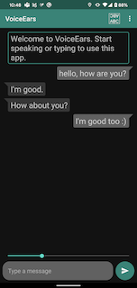
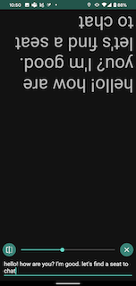
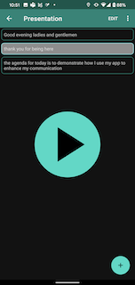

# VoiceEars

This app consists of three modes - Conversation mode, Mirror mode, and Presentation mode.

## Conversation mode

Use this mode when you want to communicate with someone or with a group. Type and enter to convert the text to speech and the app will play the audio. Have someone speak close to the microphone to convert the speech to text.

## Mirror mode

Use this mode when you want to type and show the text to someone. You can toggle the view between simple single text view or with a mirrored text.

## Presentation mode

Use this mode if you want to present with a script. Pre-add the text and click the play button during the presentation to play the audio. After it played the audio, it will auto select the next text.

## Screenshots

From left: Conversation mode, mirror mode, presentation mode

## Technical notes

On startup, the app streams the audio from microphone to Azure Cognitive Services via the SDK. The result text is then shown on the chat bubble. A recognized event signals that a bubble is final and a new bubble will be created for the subsequent result text. When the user types and enters the text, the app stops listening to microphone, sends the text to Azure Cognitive Services and receive the audio data. It then plays the audio data (visual feedback is the change of background colour for the bubble) and continues until all the audio data is played. Then, it will start listening to microphone and resume speech to text service. The voice type (for now, Male or Female only) is set in the Settings.

## How this app came about

Born deaf, I rely on written English as my means of communication when it comes to talking to hearing people around me. Consequently, I faced several obstacles. First, some people found it convenient or faster to speak rather than write to me. Second, when I want to share my input with a group, I had to type and then show the text to each person one by one. During my internship with Microsoft, I thought about how instead of trying to get others to adapt to my condition, why not I do something within my power to enhance my communication? And hence the Conversation mode was ideated and built. Subsequently, I added Mirror mode where the person in front of me could read the text on my phone. And finally I added the Presentation mode so I could present on my own.
